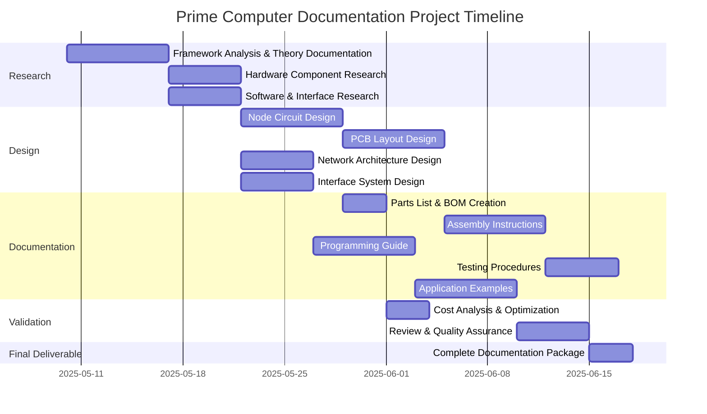
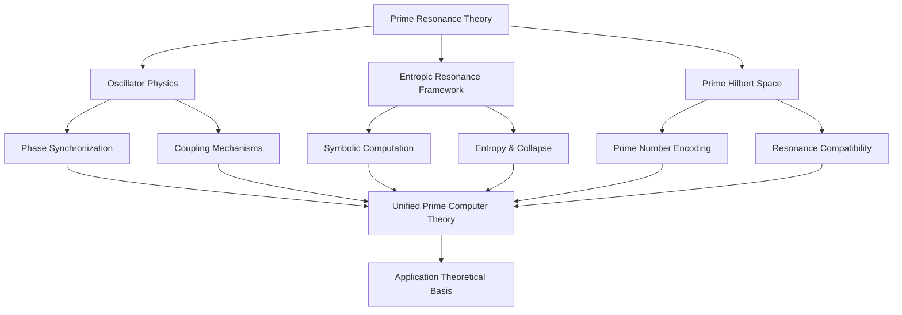
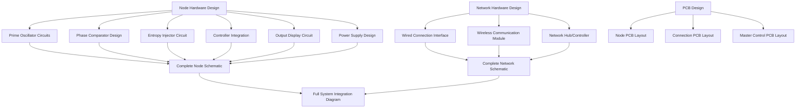
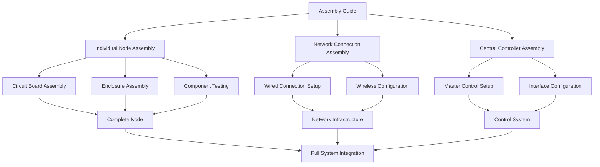
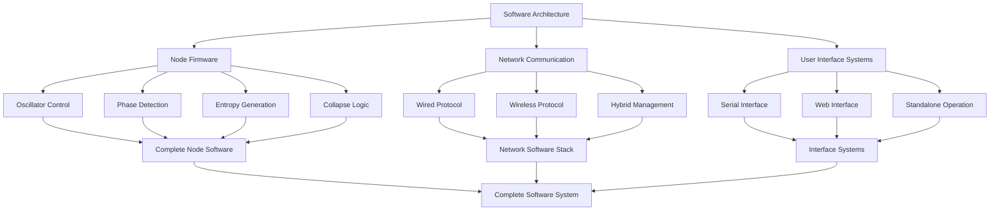
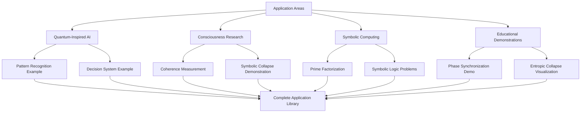

# Prime Computer Documentation Project

## Introduction

This document outlines a comprehensive plan for creating detailed documentation on how to build a prime computer system based on the Prime Resonance Hypothesis framework. The prime computer utilizes coupled oscillators tuned to prime-number frequencies to enable a new paradigm of computation beyond traditional binary logic, leveraging resonance, phase synchronization, and symbolic collapse principles.

The goal is to produce complete documentation for building a full-featured prime computer system with 20+ interconnected nodes for under $600, capable of running applications in quantum-inspired AI and consciousness research. The system will support both wired and wireless communication between nodes and offer multiple interface options.

## Detailed Plan: Prime Computer Documentation Project

### 1. Project Overview

**Objective:** Create comprehensive documentation for building a prime computer system with 20+ nodes under $600, capable of running applications in quantum-inspired AI and consciousness research.

**Deliverables:**
- Complete theoretical foundation document
- Hardware design specifications and schematics
- PCB layouts for nodes and interconnects
- Parts lists and sourcing guide
- Step-by-step assembly instructions
- Programming and firmware guides
- Testing and calibration procedures
- Application examples and experiments
- User interface documentation

### 2. Project Structure and Timeline

### 3. Detailed Breakdown of Work Components

#### 3.1 Theoretical Foundation Documentation

- **Document Sections:**
  - Introduction to Prime Resonance Hypothesis
  - Mathematical foundations of prime-based computation
  - Oscillator physics and coupled systems
  - Phase synchronization and resonance collapse
  - Symbolic computation paradigm
  - Theory of node interconnection and network dynamics
  - Theoretical applications in AI and consciousness research

#### 3.2 Hardware Design

- **Document Sections:**
  - Node hardware specifications
    - Prime oscillator circuit designs (RC, 555, digital)
    - Phase comparison circuits
    - Entropy injection mechanisms
    - Controller interface (ESP32-based)
    - Output display and feedback systems
  - Network interconnection hardware
    - Wired connections (voltage dividers, optocouplers)
    - Wireless system (ESP-NOW, WiFi)
  - PCB layouts for each component
  - 3D-printable enclosure designs
  - Complete schematics and wiring diagrams

#### 3.3 Parts List and Bill of Materials

- Detailed inventory of required components for:
  - Basic nodes (×20+)
  - Network interconnection hardware
  - Central controller
  - Interface systems
  - Power supply
  - Enclosures and mechanical elements
- Cost analysis and optimization recommendations
- Sourcing guide with alternatives and substitutions
- Parts organization and management guidance

#### 3.4 Assembly Instructions

- **Document Sections:**
  - Required tools and workspace setup
  - Component preparation and testing
  - Step-by-step node assembly instructions with photos
  - Network connection assembly
  - Controller and interface system assembly
  - System integration procedures
  - Common issues and troubleshooting

#### 3.5 Programming and Firmware

- **Document Sections:**
  - Development environment setup
  - ESP32 programming fundamentals
  - Node firmware architecture and implementation
  - Phase detection algorithms
  - Entropy generation methods
  - Network communication protocols
  - User interface development
  - API documentation for custom applications
  - Complete code examples with explanations

#### 3.6 Testing and Calibration

- **Document Sections:**
  - Initial system testing procedures
  - Node calibration methodology
  - Network synchronization testing
  - Entropy and resonance measurement
  - Performance benchmarking
  - Troubleshooting guide
  - System validation protocols
  - Safety considerations and precautions

#### 3.7 Application Examples

- **Document Sections:**
  - Basic prime computer operations
  - Setting up AI pattern recognition applications
  - Consciousness research experiment configurations
  - Non-Boolean computing examples
  - Symbolic computation demonstrations
  - Educational experiments and visualizations
  - Advanced application development guide

#### 3.8 User Interface Documentation

- **Document Sections:**
  - Serial interface command reference
  - Web interface user guide
  - Standalone operation instructions
  - Data visualization tools
  - Configuration and customization options
  - Integration with external systems
  - API documentation for developers

### 4. Resource Requirements

#### 4.1 Hardware Components (Estimated Budget: $550)

- **Node Components (~$320)**
  - 20× ESP32 Dev Boards: $160
  - Oscillator components (resistors, capacitors, 555 timers): $40
  - Phase comparators (XOR gates, comparators): $30
  - Entropy sources (Zener diodes, noise generators): $20
  - LEDs and display components: $30
  - Connectors and wiring: $40

- **Network and Interface Components (~$130)**
  - Wired connection hardware: $30
  - Wireless modules: $40
  - Central controller: $30
  - Interface hardware: $30

- **Enclosures and Physical Structure (~$100)**
  - 3D printed enclosures: $60
  - PCB fabrication: $40

#### 4.2 Software Tools

- ESP32 development environment
- Circuit design software (KiCad)
- PCB layout software
- 3D modeling software for enclosures
- Documentation tools (Markdown, LaTeX)

### 5. Quality Assurance

- Comprehensive peer review of technical documentation
- Validation against the original prime resonance framework
- Cost verification against $600 budget
- Functional testing procedures verification
- Clarity and accessibility assessment

### 6. Deliverable Format

- Comprehensive PDF documentation with embedded diagrams
- Source files for all schematics and PCB designs
- Complete firmware and software code repositories
- 3D printable STL files for enclosures
- Interactive web-based documentation (optional)
- Video demonstrations (optional)

### 7. Implementation Strategy

To execute this plan effectively, we propose the following implementation strategy:

#### 7.1 Documentation Structure

```mermaid
flowchart TD
    A[Prime Computer Documentation] --> B[01-theory/]
    A --> C[02-hardware/]
    A --> D[03-software/]
    A --> E[04-assembly/]
    A --> F[05-applications/]
    
    B --> B1[prime_resonance_basics.md]
    B --> B2[oscillator_physics.md]
    B --> B3[symbolic_computation.md]
    B --> B4[mathematical_foundations.md]
    
    C --> C1[schematics/]
    C --> C2[pcb_layouts/]
    C --> C3[parts_list.md]
    C --> C4[enclosure_designs/]
    
    D --> D1[firmware/]
    D --> D2[network_protocols/]
    D --> D3[user_interfaces/]
    D --> D4[api_reference.md]
    
    E --> E1[tools_setup.md]
    E --> E2[node_assembly.md]
    E --> E3[network_setup.md]
    E --> E4[testing_procedures.md]
    
    F --> F1[basic_operations.md]
    F --> F2[ai_applications.md]
    F --> F3[consciousness_research.md]
    F --> F4[educational_demos.md]
```

#### 7.2 Development Workflow

1. **Research Phase:**
   - Conduct detailed research on prime resonance theory
   - Evaluate component options and alternatives
   - Benchmark existing oscillator designs

2. **Prototyping Phase:**
   - Develop single-node prototype
   - Test basic communication between two nodes
   - Validate phase synchronization and resonance collapse

3. **Documentation Development:**
   - Create documentation concurrently with design
   - Use iterative approach, validating instructions during prototyping
   - Develop modular documentation that allows for various build options

4. **Review and Refinement:**
   - Test documentation with sample users
   - Refine based on feedback
   - Verify cost estimates with actual component pricing

5. **Final Package Compilation:**
   - Compile all documentation into structured repository
   - Create detailed table of contents and index
   - Produce supplementary material (videos, interactive guides)

This implementation strategy ensures that we maintain a systematic, validated approach to developing the comprehensive prime computer documentation.
